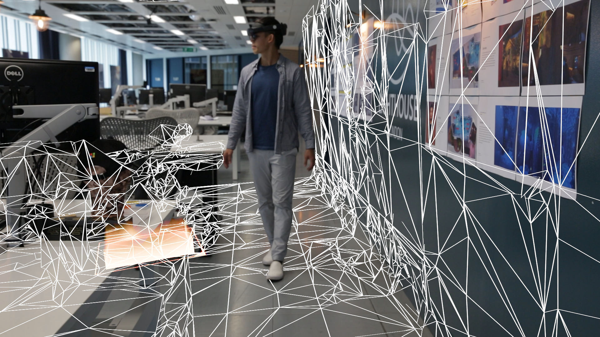
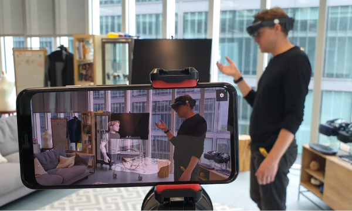
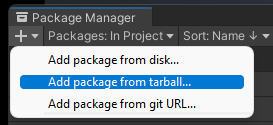
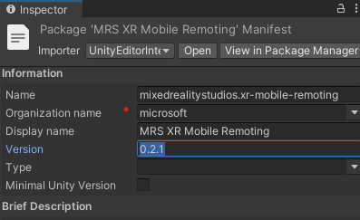

  # Mixed Reality Mobile Remoting

  A Unity plugin to preview Mixed Reality content directly on your HoloLens <i>and</i> Android phone in Play Mode, without building

  
  <i>Image taken on the companion Android app</i>

 
 

# Features
* Preview Unity content, in play mode, on HoloLens and Android phones - no need to build! 
* Integrates with existing Unity projects
* All-in-one editor tooling calibration and recording
* Project-agnostic mobile companion app
* Record video

Similar to [Holographic Remoting](https://learn.microsoft.com/en-us/azure/remote-rendering/how-tos/unity/holographic-remoting) - but instead of being limited to HoloLens devices, you can also join on an AR-enabled Android device (thus enabling third person POV, from the perspective of the HoloLens)

 

Some captures made using this tool:

 

HoloLens and mobile app spatially aligned and viewing the same content:

 

Unity Editor tooling for connecting devices and recording

# Installation
The <i>host</i> components are available as UPM packages
The Android companion app - mr-mobile-remoting-client-[version].apk 
<!-- TODO - update for GitHub Both are available in [Mobile Remoting Pipeline Artifacts](TODO) -->

## In your Unity project: 
### 1. Import and Setup MRTK via the Features Tool
Skip this step if your project is already setup for HoloLens dev.
* Download the MRTK features tool, https://docs.microsoft.com/en-us/windows/mixed-reality/develop/unity/welcome-to-mr-feature-tool
* Install and setup MRTK, https://github.com/microsoft/MixedRealityToolkit-Unity
* Commit changes to git

### 2. Install MRTK WebRTC via Unity Package Manager
* Download <code>com.microsoft.mixedreality.webrtc-2.0.2.tgz</code> from [MRTK WebRTC GitHub Releases](https://github.com/microsoft/MixedReality-WebRTC/releases/tag/v2.0.2)
* Save to the <code>Packages</code> folder in your project
* (In Unity) Window > Package Manager > Add package from tarball...  
  
* Commit all changes to git (including the package saved to <code>Packages</code>)

### 3. Install Microsoft.MixedReality.QR via Nuget
*  https://www.nuget.org/Packages/Microsoft.MixedReality.QR

### 4. Install MR Mobile via Unity Package Manager
* Download <code>com.microsoft.mixedrealitystudios.mr-mobile-remoting.*</code> (where * is your desired version) from the [Releases](/Releases/) folder
* Follow same steps in step 2. 

## On your Android phone:
### 1. Install apk via sideloading
* Copy .apk to a public folder (e.g Downloads)
* On the phone, locate the .apk and tap to install

# Usage
## 1. Add the runtime components to your scene
* Open <code>Window > MR Mobile Remoting</code>
* Click install components
* Save scene and commit changes to git

## 2. Build the Android app
Ensure you have the Android build tools installed via the Unity Hub.
* Open the ThirdPersonMobile.unity project.
* Modify the IP address in NodeDssSignaler
* Build and Run
  

### Unity Components
* MR Mobile Remoting Editor Window - a single place to start the signalling server, set camera qualities and start recordings. Accessed via <code>Window > MR Mobile Remoting</code>
* <code>MobileRemotingHost.prefab</code> - drop this in to scenes you want to view on the mobile AR app

> NOTE: The setup will always require the project running in Unity and is not intended for standalone shared experience, i.e SpectatorView

# System Requires
* Unity runnning on Windows (tested on 2020.3, Windows 11 22000.675)
* AR compatible Android device (tested on Pixel 4)

# Contributing
## Publishing changes to MR Mobile Remoting Host (<code>ThirdPersonRemoting.Unity</code> project)
### 1. Modify directly from the Packages folder. Unity and Intellisense should all work as expected
### 2. Increment version
* Select <code>Packages/MR Mobile Remoting/readme</code> and increment the version number using semantic versioning  
  
* Update the CHANGELOG.md that resides in the same folder

### 3. Create .tgz package
* <code>Tools > MR Mobile Remoting > Export UPM Package (.tgz)</code>. Select the <code>Releases</code> folder in the project root
* Commit to repo and create PR.

### 4. Create git tag
* Use DevOps to create a tag with the version number as the name

## Publishing changes to Android AR app (<code>ThirdPersonMobile.Unity</code> project)
TODO

# Architecture
Everything is rendered inside Unity. Once connected, the mobile app sends its [Pose](https://docs.unity3d.com/ScriptReference/Pose.html) to Unity. Unity uses this data to update a Camera's position and rotation, and responds with the resultant image taken from that new point of view. This image is rendered at full screen, given the impression that the mobile phone is in the same "world" as the HoloLens app.

## Concepts
### Unity Remoting Host
The project you want to make recordings of and also where you imported <code>MobileRemotingHost.prefab</code> into., for example, CCH, GEM.

### Holographic Remoting
Built-in Unity functionality that enables Unity to use a HoloLens device as a display in play mode. The scene is rendered inside Unity. 

### Holographic Remoting Session
Essentially Unity in play mode, but with a HoloLens device connected as per above.

### Mobile Remoting 
Like Holographic Remoting, but with our AR mobile as the client

### Mobile Remoting Host
A set of runtime components to enable a MHR session, built on the MRTK WebRTC package 

# Known Limitations
* Latency of up to 1000ms between moving the mobile phone and receiving the updated image.
* The scene will be rendered inside Unity, so any UWP-specific code won't run
* Android camera instrisics are not taken in to account - hologram alignment issues are likely occur 

## Contributing

This project welcomes contributions and suggestions.  Most contributions require you to agree to a
Contributor License Agreement (CLA) declaring that you have the right to, and actually do, grant us
the rights to use your contribution. For details, visit https://cla.opensource.microsoft.com.

When you submit a pull request, a CLA bot will automatically determine whether you need to provide
a CLA and decorate the PR appropriately (e.g., status check, comment). Simply follow the instructions
provided by the bot. You will only need to do this once across all repos using our CLA.

This project has adopted the [Microsoft Open Source Code of Conduct](https://opensource.microsoft.com/codeofconduct/).
For more information see the [Code of Conduct FAQ](https://opensource.microsoft.com/codeofconduct/faq/) or
contact [opencode@microsoft.com](mailto:opencode@microsoft.com) with any additional questions or comments.

## Trademarks

This project may contain trademarks or logos for projects, products, or services. Authorized use of Microsoft 
trademarks or logos is subject to and must follow 
[Microsoft's Trademark & Brand Guidelines](https://www.microsoft.com/en-us/legal/intellectualproperty/trademarks/usage/general).
Use of Microsoft trademarks or logos in modified versions of this project must not cause confusion or imply Microsoft sponsorship.
Any use of third-party trademarks or logos are subject to those third-party's policies.
